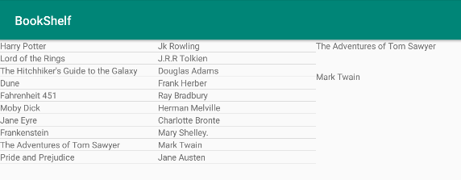
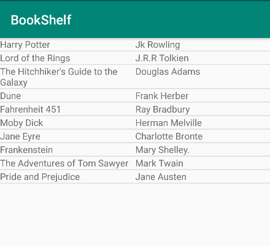
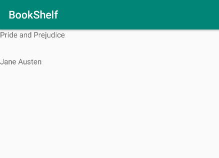
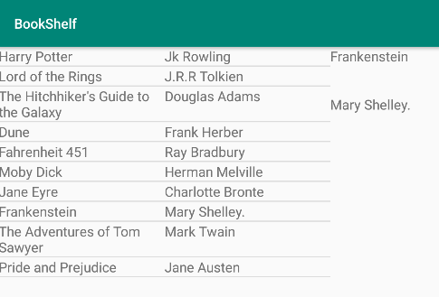

# BookShelf
Maguire Qvale Introduction to Mobile Application Development section 003 Assignment 7 App. 
Using 2 fragments user can click a book in a ListView and the books title and author will appear. If in portait there is only one fragment on the screen at a time, but in landscape/tablet the two views can be seen at once. The program work in landscape and in potrait, but sometimes crashes when switching from one to the other. If BookDetails is being displayed and user tries to rotate phone it will most likely crash. Problem does not happen when using a tablet.
   

